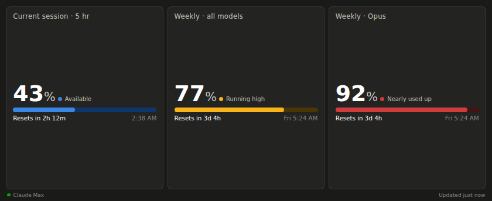
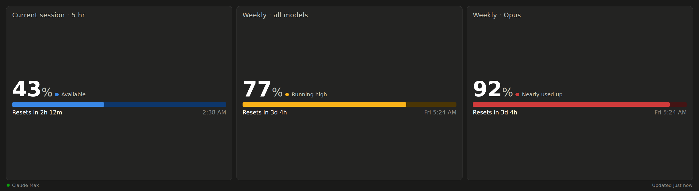

# Claude Usage — Corsair Xeneon Edge widget

Show your live Claude subscription usage on a [Corsair Xeneon Edge](https://www.corsair.com/us/en/p/monitors/cm-9020001-ww/xeneon-edge)
touchscreen: the **5-hour session** limit and **weekly** limits, each with a
severity-colored meter and a "resets in…" countdown. The same numbers Claude
Code shows in `/usage`, always on your desk.

Adapts to any Edge slot — small, full-width, or vertical:

## How it works

| Part | What it does |
|---|---|
| `helper/ClaudeUsageServer.ps1` | Tiny background server (plain PowerShell, no dependencies). Reads Claude Code's saved login, fetches usage from Anthropic once a minute, serves it at `http://127.0.0.1:8787`. Renews the login automatically with the stored refresh token. |
| `widget/` | The iCUE widget (HTML/CSS/JS). Fetches from the helper and renders it. |

The widget runs in a sandboxed web view inside iCUE and can't read files, which
is why the helper exists. Everything stays on your machine: the helper listens
on `127.0.0.1` only and talks only to `api.anthropic.com` (and Anthropic's
OAuth endpoint for renewal). Your token is never embedded in any file here.

## Install

**Prereqs:** Windows + iCUE 5.46+, a Xeneon Edge, and [Claude Code](https://code.claude.com)
logged in once on this PC (`claude` in a terminal — native Windows or WSL both work).

1. Run `build.ps1` (or grab a release) to produce `dist/ClaudeUsage.icuewidget`.
2. Run `helper/install.bat` — installs the helper to `%LOCALAPPDATA%\ClaudeUsageWidget`,
   adds it to Startup, starts it now.
3. Sanity check: open <http://127.0.0.1:8787/> — you should see your usage.
4. Double-click `dist/ClaudeUsage.icuewidget` to import it into iCUE, then drag
   "Claude Usage" onto an Edge slot.

No iCUE widget import needed? iCUE's built-in **iFrame widget** pointed at
`http://127.0.0.1:8787/` shows the same dashboard.

## Notes

- **Colors:** blue = fine, amber = ≥70% used, red = ≥90% used.
- **Login renewal is automatic.** The helper refreshes the token the same way
  Claude Code does and writes it back to `.credentials.json`. You only need to
  log in again if the login is revoked (logout everywhere / password change).
- **Change the port** in `$Port` at the top of `ClaudeUsageServer.ps1` and in
  the widget's "Helper port" setting in iCUE.
- **Only recognized limit types are shown** (session, weekly buckets, extra
  credit). Unannounced fields the endpoint sometimes returns are hidden — see
  `isUseful()` in `widget/index.html` to adjust.
- **Uninstall:** `helper/uninstall.bat`, then remove the widget from iCUE.

## Disclaimer

This is an **unofficial personal-use tool**, not affiliated with or endorsed by
Anthropic or Corsair. It reads usage data for **your own account** via the same
undocumented endpoints Claude Code itself uses; Anthropic may change or restrict
them at any time, and Anthropic's usage policies restrict how subscription
credentials may be used outside official surfaces — review them before use.
It performs no inference and never transmits your credentials anywhere except
to Anthropic itself. Never commit `token.txt` or anything under `~/.claude`
(the `.gitignore` here guards both).

## License

MIT — see [LICENSE](LICENSE). 